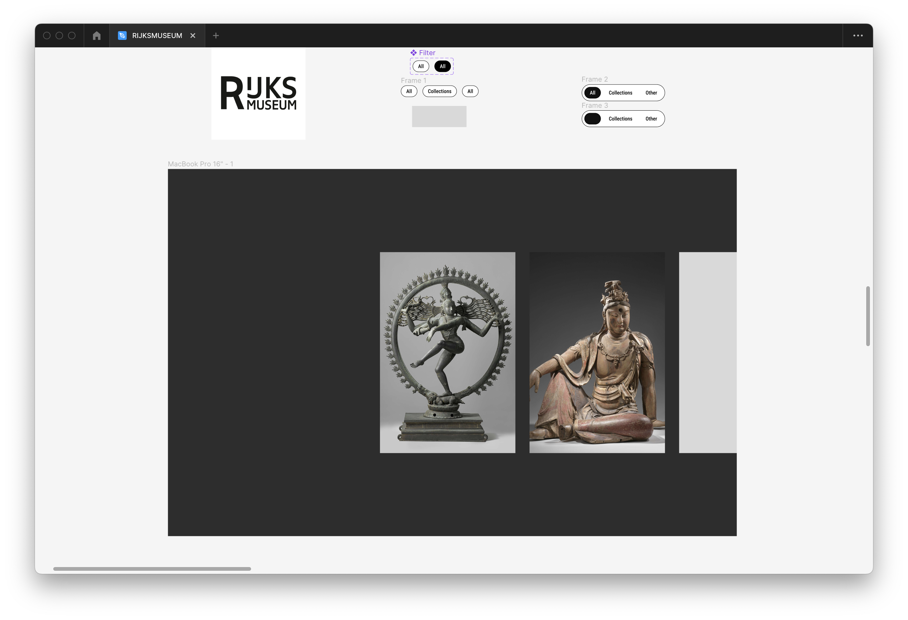

# 􀧏 Web App From Scratch

[GitHub - GiovanniDw/web-app-from-scratch-2223](https://github.com/GiovanniDw/web-app-from-scratch-2223)

[RijksMuseum COVID-23](https://giovannidw.github.io/SPA/)

# Assignment

### Rubic

| **Deficiency**    | **Criterion**                                                                                                                                                       |
| ----------------- | ------------------------------------------------------------------------------------------------------------------------------------------------------------------- |
| *User Interface*  | you design, build and test the user interface by applying interface design principles                                                                               |
| *Code structure*  | you write modular, consistent and efficient HTML, CSS and JavaScript code by applying structure and best practices. You manage state for the application and the UI |
| *Data management* | \- you understand how you can work with an external API using asynchronous code. You can retrieve data, manipulate and dynamically convert it to structured html    |
| *Project*         | your app is working and published on GitHub Pages. Your project is thoroughly documented in the `README.md` file in your repository.                                |

# User Interface



.png)

# Code Structure

### File Structure

```bash
.
├── LICENSE
├── README.md
├── deploy.s
├── index.html
├── package.json
├── public
│   └── Logo.png
├── src
│   ├── assets
│   │   └── Logo.png
│   ├── css
│   │   └── main.css
│   └── js
│       ├── api.js
│       ├── app.js
│       ├── components
│       │   └── header.js
│       ├── render.js
│       ├── router.js
│       ├── search.js
│       ├── ui.js
│       └── vendor
│           └── routie.js
├── vite.config.js
└── yarn.lock
```

### State

```javascript
export function handleRoutes() {
  Routie(
    {
      '': async () => {
        const data = await getDynamicMuseumData(museumOptionsHome);
        render(data, undefined, "home");
        updateUI('home');
      },
      'art': async () => {
        const data = await getDynamicMuseumData(museumOptions);
        render(data, undefined, "art");
        updateUI('art');
      },
      'art/:id': async (id) => {
        const data = await getDynamicMuseumData(museumOptions, id);
        render(data, id, "art-detail");
        // updateUI('art');
      },
      'search': async () => {
        const value = await searchInputValue()
        const searchInput = await getLocalSearchInput();
        const data = await searchMuseumData(searchInput);
        render(data, undefined, "search");
        updateUI('search');
      }
    });
}
```

### Update UI

```javascript
export function updateUI(route, id) {
  const sections = $$('section');
  const articles = $$('article');
  const activeSection = $(`[data-route=${route}]`);
  sections.forEach(section => {
    section.classList.remove('active')
  });
  activeSection.classList.add('active')
}
```

# Data Management

### External API

```javascript
const apiKey = process.env.API_KEY;
const URL = `https://www.rijksmuseum.nl/api/en/collection?key=${apiKey}&imgonly=true`;

export const getDynamicMuseumData = async (options, id) => {
  const { lang, color, involvedMaker, search } = options;
  if (!id) {
    const urlParams = `${URL}&q${search}&ps=100&s=relevance&toppieces=true`
   const data = await request(urlParams);
    const formattedResults = await formatMuseumResults(data);
    return formattedResults;
    return data
  } else {
    const urlParams = `https://www.rijksmuseum.nl/api/en/collection/${id}?key=${apiKey}`
	const data = await request(urlParams);
    const formattedResults = await formatMuseumResults(data);
    return formattedResults;
  }
};
```

### Retrieve Data

```javascript
const request = async (url) => {
  try {
    const res = await fetch(url);
    const data = await res.json();
    return data
  } catch (err) {
      console.log(err);
      throw new Error(err)
    }
  };
```

### Manipulating Data

```javascript
export const formatMuseumResults = (data) => {
  const array = data.artObjects;
  return array.map((d) => {
    return {
      id: d.objectNumber,
      title: d.title,
      name: d.name,
      headerImage: d.headerImage,
      productionPlaces: d.productionPlaces,
      links: d.links,
      longTitle: d.longTitle,
      webImage: d.webImage,
      principalOrFirstMaker: d.principalOrFirstMaker,
    };
  });
};
```

### Conferting to HTML

### Render

```javascript
export function render(data, id, page) {
  switch (page) {
    case "home":
      homePage(data.artObjects)
      break;
    case "art":
      collection(data.artObjects)
      break;
    case "art-detail":
      item(data.artObject, id)
      break;
    case "search":
      collectionSearch(data.artObjects)
      break;
    default:
      collection(data.artObjects)
      break;
  }
}
```

```javascript
function homePage(data) {
  const section = $('section[data-route=home]')
  console.log(data)
  data.forEach((item) => {
    const { webImage, objectNumber, headerImage } = item
    const id = objectNumber;
    const article = document.createElement('div');
    article.classList.add('art-container');
    const html = /*html*/`
      <article class='museum-item' id='${id}'">
        
        <div class='item-content'>
        <a href="#art/${id}">
          <h4>${item.title}</h4>
        </a>
        </div>
      </article>
    `;
    section.insertAdjacentHTML('beforeend', html)
  })
}
```

# Bronnen

[How to create a front end project structure that scales and is easy to maintain?](https://www.blog.duomly.com/how-to-create-frontend-project-structure-that-scales-and-is-easy-to-maintain/)

[Florin Pop - Instant Search with Vanilla JavaScript](https://www.florin-pop.com/blog/2019/06/vanilla-javascript-instant-search/)

[23 CSS Reveal Animations](https://freefrontend.com/css-reveal-animations/)

[CSS Grid can be used to stack elements](https://www.stefanjudis.com/today-i-learned/css-grid-can-be-used-to-stack-elements/)

[Store User Input in a Variable with JavaScript - Made Easy](https://www.ceos3c.com/javascript/store-user-input-in-a-variable-with-javascript/?utm_content=cmp-true)

